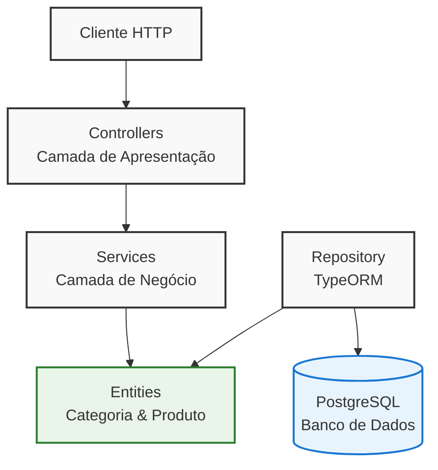

# Sistema de Gerenciamento de Lojas

## 📋 Visão Geral

Este projeto é uma API REST desenvolvida em **Node.js** com **TypeScript** para gerenciar categorias e produtos de lojas. A aplicação implementa um sistema CRUD completo com relacionamento 1:N entre categorias e produtos, utilizando **TypeORM** como ORM, **PostgreSQL** como banco de dados e **Zod** para validação de dados.

## 🏗️ Arquitetura da Solução

### Diagrama da Arquitetura



### Estrutura de Pastas

```
src/
├── config/              # Configurações da aplicação
├── controllers/         # Controladores das rotas (camada de apresentação)
├── database/           # Configuração do banco de dados
├── entities/           # Entidades do TypeORM (modelos de dados)
├── errors/             # Classes de erro personalizadas
├── middlewares/        # Middlewares (validação, tratamento de erros)
├── routes/             # Definição das rotas da API
├── services/           # Regras de negócio (camada de aplicação)
├── validates/          # Esquemas de validação com Zod
└── server.ts           # Ponto de entrada da aplicação
```

## 🔧 Decisões de Design

### 1. **Arquitetura em Camadas**
- **Controller Layer**: Responsável por receber requisições HTTP e retornar respostas
- **Service Layer**: Contém a lógica de negócio e regras de aplicação
- **Repository Layer**: Abstração para acesso aos dados (fornecida pelo TypeORM)

### 2. **Padrão de Injeção de Dependência**
```typescript
// Exemplo no CategoriaController
constructor(categoriaService: CategoriaService){
    this.categoriaService = categoriaService;
}
```

### 3. **Validação com Zod**
- Validação de entrada de dados antes do processamento
- Schemas reutilizáveis para diferentes operações
- Mensagens de erro personalizadas e claras

### 4. **Tratamento de Erros Centralizado**
- Middleware de tratamento de erros global
- Classe `AppError` para erros de aplicação específicos
- Logging de erros com Winston

### 5. **Relacionamento de Entidades**
```typescript
// Categoria (1) -> Produtos (N)
@OneToMany(() => Produto, (produto) => produto.categoria)
produtos!: Produto[];

// Produto (N) -> Categoria (1)
@ManyToOne(() => Categoria, (categoria) => categoria.produtos)
categoria!: Categoria;
```

## 📊 Entidades do Banco de Dados

### Categoria
- `id`: UUID (Primary Key)
- `nome`: String (Unique, Required)
- `descricao`: String (Optional)
- `dataCriacao`: DateTime (Auto-generated)
- `dataAtualizacao`: DateTime (Auto-updated)
- `produtos`: Relacionamento com Produto[]

### Produto
- `id`: UUID (Primary Key)
- `nome`: String (Required)
- `descricao`: String (Optional)
- `preco`: Float (Required, > 0)
- `estoque`: Integer (Required, >= 0)
- `dataCriacao`: DateTime (Auto-generated)
- `dataAtualizacao`: DateTime (Auto-updated)
- `categoria`: Relacionamento com Categoria

## 🛡️ Princípios de Divisão de Responsabilidades

### Single Responsibility Principle (SRP)
- **Controllers**: Apenas manipulam requisições/respostas HTTP
- **Services**: Apenas lógica de negócio
- **Repositories**: Apenas acesso a dados
- **Middlewares**: Apenas funções transversais (validação, logs, etc.)

### Dependency Inversion Principle (DIP)
- Controllers dependem de abstrações (Services)
- Services utilizam repositórios através do TypeORM
- Configurações externalizadas via variáveis de ambiente

### Open/Closed Principle (OCP)
- Middlewares podem ser facilmente adicionados/removidos
- Novos validadores Zod podem ser criados sem modificar código existente
- Estrutura permite extensão sem modificação

## 🚀 Configuração e Instalação

### Pré-requisitos
- **Node.js** (versão 18 ou superior)
- **PostgreSQL** (versão 12 ou superior)
- **npm** ou **yarn**

### Passo a Passo

1. **Clone o repositório**
```bash
git clone <url-do-repositorio>
cd gerenciamento-lojas
```

2. **Instale as dependências**
```bash
npm install
```

3. **Configure as variáveis de ambiente**
Crie um arquivo `.env` na raiz do projeto:
```env
NODE_ENV=development
DB_HOST=localhost
DB_PORT=5432
DB_USER=postgres
DB_PASS=sua_senha
DB_NAME=gerenciamentoLojas
PORT=6060
```

4. **Configure o banco de dados**
- Crie um banco de dados PostgreSQL com o nome especificado no `.env`
- O TypeORM criará as tabelas automaticamente no primeiro start

5. **Execute a aplicação**
```bash
# Modo desenvolvimento
npm run dev
```

A API estará disponível em `http://localhost:6060`

## � Docker / Containerização

### Usando Docker Compose (Recomendado)

1. **Crie um arquivo `docker-compose.yml`**
```yaml
version: '3.8'
services:
  app:
    build: .
    ports:
      - "6060:6060"
    environment:
      - NODE_ENV=production
      - DB_HOST=postgres
      - DB_PORT=5432
      - DB_USER=postgres
      - DB_PASS=123456
      - DB_NAME=gerenciamentoLojas
    depends_on:
      - postgres
    volumes:
      - ./logs:/app/logs

  postgres:
    image: postgres:15-alpine
    environment:
      - POSTGRES_DB=gerenciamentoLojas
      - POSTGRES_USER=postgres
      - POSTGRES_PASSWORD=123456
    ports:
      - "5432:5432"
    volumes:
      - postgres_data:/var/lib/postgresql/data

volumes:
  postgres_data:
```

2. **Crie um `Dockerfile`**
```dockerfile
FROM node:18-alpine

WORKDIR /app

COPY package*.json ./
RUN npm ci --only=production

COPY . .
RUN npm run build

RUN mkdir -p /app/logs

EXPOSE 6060

CMD ["node", "dist/server.js"]
```

3. **Execute com Docker Compose**
```bash
# Construir e executar
docker-compose up --build

# Executar em background
docker-compose up -d

# Parar os serviços
docker-compose down
```

### Usando apenas Docker

```bash
# Construir a imagem
docker build -t gerenciamento-lojas .

# Executar (com PostgreSQL externo)
docker run -p 6060:6060 \
  -e DB_HOST=localhost \
  -e DB_PORT=5432 \
  -e DB_USER=postgres \
  -e DB_PASS=sua_senha \
  -e DB_NAME=gerenciamentoLojas \
  gerenciamento-lojas
```

## �📚 Endpoints da API

### Categorias

| Método | Endpoint | Descrição |
|--------|----------|-----------|
| GET | `/api/categorias` | Lista todas as categorias |
| POST | `/api/categorias` | Cria uma nova categoria |
| PUT | `/api/categorias/:id` | Atualiza uma categoria |
| DELETE | `/api/categorias/:id` | Remove uma categoria |

### Produtos

| Método | Endpoint | Descrição |
|--------|----------|-----------|
| GET | `/api/produtos` | Lista todos os produtos |
| POST | `/api/produtos` | Cria um novo produto |
| PUT | `/api/produtos/:id` | Atualiza um produto |
| DELETE | `/api/produtos/:id` | Remove um produto |

## 📝 Exemplos de Uso

### Criar Categoria
```json
POST /api/categorias
{
    "nome": "Eletrônicos",
    "descricao": "Produtos eletrônicos e tecnológicos"
}
```

### Criar Produto
```json
POST /api/produtos
{
    "nome": "Smartphone Samsung",
    "descricao": "Smartphone Android com 128GB",
    "preco": 899.99,
    "estoque": 25
}
```

## 🧪 Exemplos com cURL

### Testando Categorias

**Listar todas as categorias:**
```bash
curl -X GET http://localhost:6060/api/categorias \
  -H "Content-Type: application/json"
```

**Criar uma nova categoria:**
```bash
curl -X POST http://localhost:6060/api/categorias \
  -H "Content-Type: application/json" \
  -d '{
    "nome": "Eletrônicos",
    "descricao": "Produtos eletrônicos e tecnológicos"
  }'
```

**Atualizar uma categoria:**
```bash
curl -X PUT http://localhost:6060/api/categorias/UUID_DA_CATEGORIA \
  -H "Content-Type: application/json" \
  -d '{
    "nome": "Eletrônicos Atualizados",
    "descricao": "Categoria atualizada"
  }'
```

**Deletar uma categoria:**
```bash
curl -X DELETE http://localhost:6060/api/categorias/UUID_DA_CATEGORIA \
  -H "Content-Type: application/json"
```

### Testando Produtos

**Listar todos os produtos:**
```bash
curl -X GET http://localhost:6060/api/produtos \
  -H "Content-Type: application/json"
```

**Criar um novo produto:**
```bash
curl -X POST http://localhost:6060/api/produtos \
  -H "Content-Type: application/json" \
  -d '{
    "nome": "iPhone 15",
    "descricao": "Smartphone Apple com 256GB",
    "preco": 1299.99,
    "estoque": 10
  }'
```

**Atualizar um produto:**
```bash
curl -X PUT http://localhost:6060/api/produtos/UUID_DO_PRODUTO \
  -H "Content-Type: application/json" \
  -d '{
    "nome": "iPhone 15 Pro",
    "preco": 1499.99,
    "estoque": 5
  }'
```

**Deletar um produto:**
```bash
curl -X DELETE http://localhost:6060/api/produtos/UUID_DO_PRODUTO \
  -H "Content-Type: application/json"
```

### Testando Validações de Erro

**Tentar criar categoria sem nome (erro 400):**
```bash
curl -X POST http://localhost:6060/api/categorias \
  -H "Content-Type: application/json" \
  -d '{
    "descricao": "Categoria sem nome"
  }'
```

**Tentar criar produto com preço inválido (erro 400):**
```bash
curl -X POST http://localhost:6060/api/produtos \
  -H "Content-Type: application/json" \
  -d '{
    "nome": "Produto Teste",
    "preco": -10,
    "estoque": 5
  }'
```

### Exemplo de Resposta de Sucesso
```json
{
  "id": "123e4567-e89b-12d3-a456-426614174000",
  "nome": "Eletrônicos",
  "descricao": "Produtos eletrônicos e tecnológicos",
  "dataCriacao": "2026-02-08T10:30:00.000Z",
  "dataAtualizacao": "2026-02-08T10:30:00.000Z"
}
```

### Exemplo de Resposta de Erro
```json
{
  "status": "validation-error",
  "error": [
    {
      "field": "nome",
      "message": "Nome da categoria é obrigatório."
    }
  ]
}
```

## 🔒 Segurança

A aplicação implementa várias medidas de segurança:

- **Helmet**: Protege contra vulnerabilidades conhecidas
- **CORS**: Configurado para controlar acesso de origem cruzada
- **Rate Limiting**: Limita requisições (100 por 15 minutos por IP)
- **Validação de Entrada**: Todos os dados são validados com Zod
- **Tratamento de Erros**: Evita vazamento de informações sensíveis

## 📦 Tecnologias Utilizadas

### Core
- **Node.js**: Runtime JavaScript
- **TypeScript**: Superset tipado do JavaScript
- **Express.js**: Framework web minimalista

### Banco de Dados
- **TypeORM**: ORM para TypeScript/JavaScript
- **PostgreSQL**: Sistema de gerenciamento de banco de dados

### Validação e Segurança
- **Zod**: Validação de esquemas TypeScript-first
- **Helmet**: Middleware de segurança
- **CORS**: Middleware para Cross-Origin Resource Sharing
- **Express Rate Limit**: Limitação de taxa de requisições

### Desenvolvimento
- **Nodemon**: Monitoramento de arquivos em desenvolvimento
- **TSX**: Executor TypeScript rápido
- **Winston**: Biblioteca de logging

## 🚀 Scripts Disponíveis

```json
{
  "dev": "nodemon --watch src/**/*.ts --exec tsx src/server.ts"
}
```

## 🎯 Funcionalidades Implementadas

✅ **CRUD completo** para Categorias e Produtos  
✅ **Relacionamento 1:N** entre Categoria e Produto  
✅ **Validação de dados** com Zod  
✅ **Tratamento de erros** centralizado  
✅ **Middleware de validação** reutilizável  
✅ **Logging** de erros  
✅ **Configuração via variáveis de ambiente**  
✅ **Medidas de segurança** (Helmet, CORS, Rate Limiting)  
✅ **Compressão** de respostas  
✅ **Arquitetura em camadas**  

## 📋 Melhorias Futuras

- [ ] Implementar autenticação e autorização
- [ ] Adicionar paginação nas listagens
- [ ] Implementar filtros e busca
- [ ] Adicionar testes unitários e de integração
- [ ] Implementar cache (Redis)
- [ ] Adicionar documentação automática (Swagger)
- [ ] Implementar migrations para versionamento do banco
- [ ] Adicionar CI/CD pipeline


---
